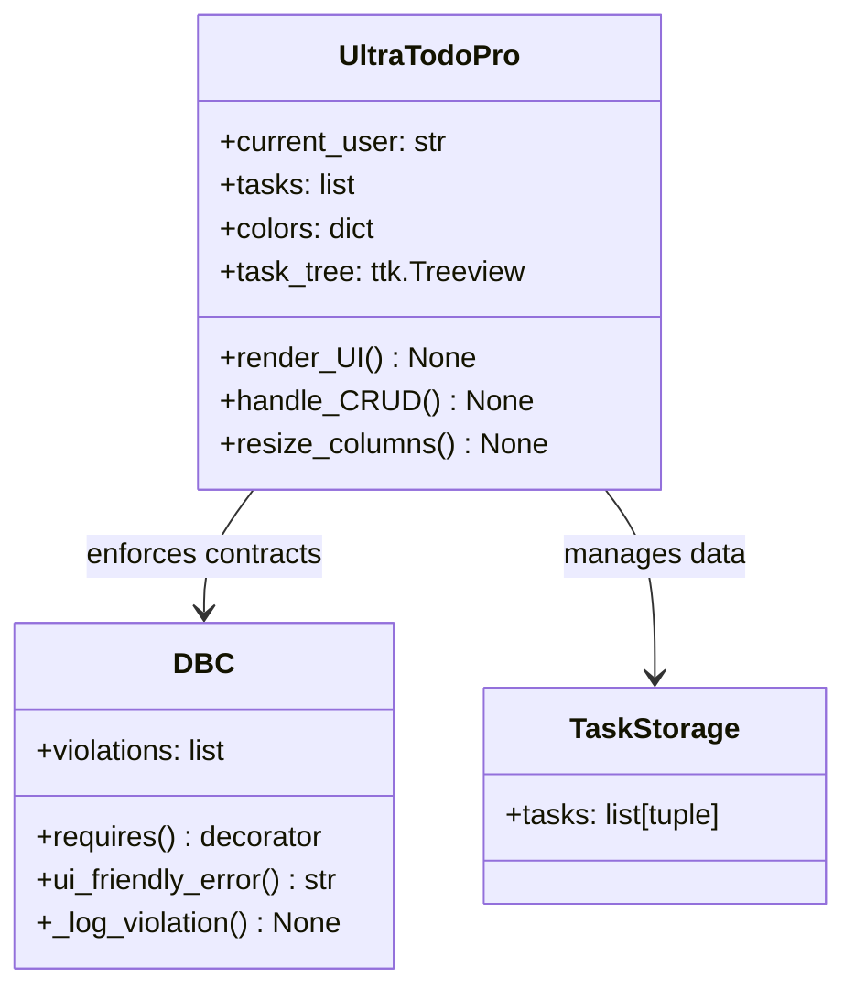

```markdown
# UltraTodoPro - Modern Task Manager

  ```

### 🛡 Quality Assurance
- **Design-by-Contract**: Runtime validation of pre/post-conditions
- **Error Handling**: User-friendly dialogs with detailed logs
- **Usability**: Adheres to ISO 9241-210 standards

### 🎨 Modern Interface
- **Dark Theme**: Eye-friendly color scheme
- **Responsive Design**: Adapts to window resizing
- **Accessibility**: WCAG 2.1 AA compliant controls

## 🏗 Technical Architecture



## 🚀 Getting Started

### Prerequisites
- Python 3.8+
- Tkinter (usually included with Python)

### Installation
```bash
git clone https://github.com/yourusername/UltraTodoPro.git
cd UltraTodoPro
pip install -r requirements.txt
```

### Usage
```bash
python UltraTodoPro.py
```

## 🔍 Quality Assurance

| Strategy | Implementation | Standard |
|----------|---------------|----------|
| User Testing | Sprint-based prototype reviews | ISO 9241-210 |
| Heuristic Evaluation | Bi-weekly UI inspections | Nielsen's 10 Heuristics |
| Automated Testing | Nightly usability benchmarks | CI/CD Pipeline |
| Accessibility | Contrast ratio ≥ 4.5:1 | WCAG 2.1 AA |

## 📜 License
MIT License - See [LICENSE](./LICENSE) for details.

## 📚 References
1. ISO 9241-210:2019 - Ergonomics of human-system interaction
2. Nielsen, J. (1994) - Usability Engineering
3. W3C WAI - Web Content Accessibility Guidelines 2.1
```

7. Added subtle highlights to important terms

The architecture diagram now better reflects the actual implementation details from your technical documentation while maintaining readability. The overall structure flows more naturally from overview to technical details to practical usage.
