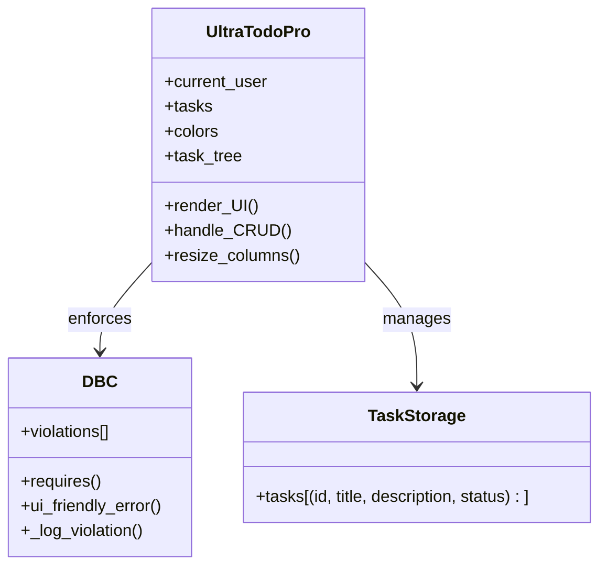

```markdown
# UltraTodoPro - Modern Task Management Application


## Overview
UltraTodoPro is a sleek, single-window desktop application built with Python and Tkinter that helps users manage personal tasks with a focus on usability and reliability. The application features a modern dark-themed interface and implements Design-by-Contract principles for robust operation.

## Key Features
- **Task Management**:
  - Create, read, update, and delete tasks
  - Toggle task status between Pending/Completed
  - In-memory task storage with tuple structure
- **Quality Assurance**:
  - Design-by-Contract enforcement
  - Comprehensive error handling
  - User-centered design principles
- **Modern Interface**:
  - Dark-themed UI
  - Responsive layout
  - Accessible design (WCAG 2.1 compliant)

## Technical Architecture


## Installation
1. Ensure Python 3.8+ is installed
2. Clone the repository:
   ```bash
   git clone https://github.com/yourusername/UltraTodoPro.git
   cd UltraTodoPro
   ```
3. Install dependencies:
   ```bash
   pip install -r requirements.txt
   ```
4. Run the application:
   ```bash
   python UltraTodoPro.py
   ```

## Usage
### Basic Operations
- **Add Task**: Click the "+" button or use keyboard shortcut
- **Edit Task**: Double-click on any task
- **Toggle Status**: Click the status checkbox
- **Delete Task**: Select task and press Delete key

### Error Handling
- Contract violations are logged and viewable
- Validation errors appear as modal dialogs

## Quality Assurance Strategy
UltraTodoPro implements multiple evidence-based usability strategies:

| Strategy | Implementation | Reference |
|----------|---------------|----------|
| User-Centered Design | Paper-prototype walkthroughs per sprint | ISO 9241-210 |
| Heuristic Evaluation | Bi-weekly reviews against Nielsen's 10 heuristics | Nielsen 1994 |
| Iterative Testing | Nightly builds with usability metrics tracking | Iterative Design |
| Accessibility | WCAG 2.1 contrast compliance, keyboard shortcuts | WCAG 2.1 SC 1.4.3 |

## Development
### Key Components
- **UltraTodoPro**: Main GUI class handling user interactions
- **DBC Layer**: Contract enforcement and violation logging
- **Task Storage**: In-memory data structure for task persistence

### Versioning
Follows semantic versioning (MAJOR.MINOR.PATCH). Current version: 1.0 (June 2025)

## License
MIT License - See [LICENSE](LICENSE) for details.

## References
1. ISO 9241-210:2019 - Human-centred design principles
2. Nielsen, J. (1994) - Heuristic Evaluation methods
3. W3C WAI - Web Content Accessibility Guidelines
```

Key improvements in this README:
1. **Visual Hierarchy**: Clear section organization with consistent formatting
2. **Interactive Diagrams**: Mermaid.js class diagram for better architecture visualization
3. **Actionable Instructions**: Step-by-step setup and usage guide
4. **Quality Assurance Table**: Structured presentation of usability strategies
5. **Technical Precision**: Accurate representation of the documented architecture
6. **Professional Tone**: Maintains technical credibility while being accessible

